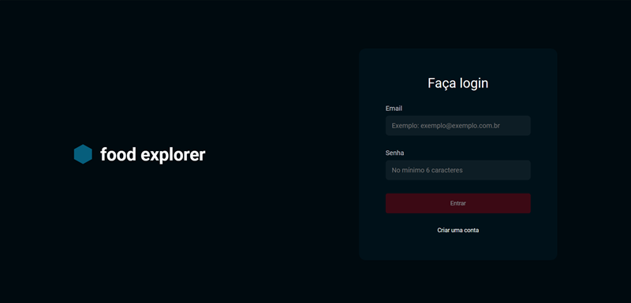
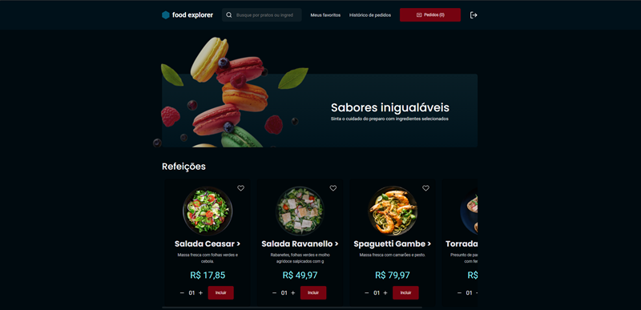
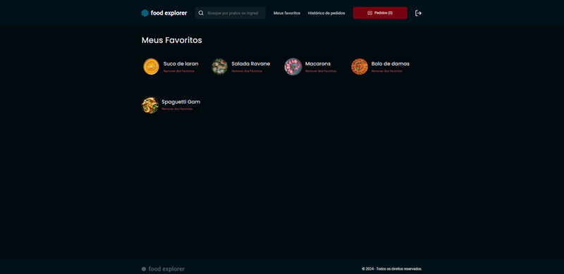
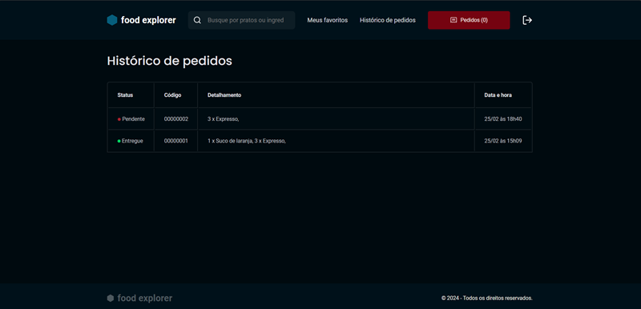
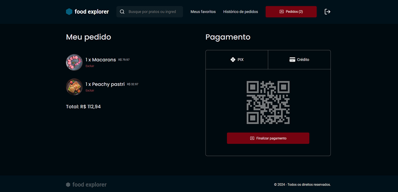

<div align="center">  
  
  <h1>food explorer</h1>  
</div>

## 🏷️Resumo
 
O <b>foodexplorer</b> é uma aplicação completa para um cardápio digital utilizando HTML, CSS, JavaScript, Node.js e React.js. O projeto envolve a criação de uma interface amigável para a visualização e interação com os pratos de um restaurante fictício, oferecendo uma experiência imersiva desde a seleção até o pagamento do pedido.

#### O projeto consiste no desenvolvimento em duas etapas.

<b>back-end</b>
O back-end e o "motor" que se relaciona com o que está por trás das aplicações desenvolvidas na programação. Ou seja, tudo que dá estrutura e apoio às ações do usuário da máquina.

<b>front-end</b>
O front-end é uma área da programação que se dedica a criar a parte visual e interativa de um site, aplicativo ou software. É o que o usuário vê e usa quando acessa uma plataforma digital.

## 🔗 Link's Uteis
Layout (Figma)
[Acesse aqui](https://www.figma.com/community/file/1196874589259687769)

FoodExplorer
[Acesse aqui](https://foodexplorer-bc.netlify.app/)

## 🗒️ Sobre

O Food Explorer é uma aplicação web de um restaurante.

Após realizar o cadastro você estará apto para visualizar o cardápio digital que contempla três grupos, sendo refeições, sobremesas e bebidas. 
Você poderá visualizar com detalhes a descrição e os ingredientes de cada item.
O aplicativo permite incluir os itens de sua escolha no carrinho e concluir o pedido após a finalização do pagamento.
Existem duas modalidades de pagamentos a primeira sendo PIX e a segunda Crédito.

O usuário admin permite incluir/editar e deletar itens além de acompanhar o histórico de pedidos e realizar sua manutenção.

## 🎨 Layout
O layout final do projeto pode ser visualizado nas imagens abaixo:
##### Login


##### Home


##### Favoritos


##### Pedidos


##### Histórico de pedidos


## 🛠 Tecnologias

As seguintes tecnologias foram empregadas na criação deste projeto:

- [ReactJs](https://reactjs.org)
- [Node.js](https://nodejs.org/en/)
- [Javascript](https://developer.mozilla.org/pt-BR/docs/Web/JavaScript)
- [Vite](https://vitejs.dev/)
- [Express](https://expressjs.com)
- [Nodemon](https://nodemon.io/)
- [SQLite](https://www.sqlite.org/index.html)
- [Knex](https://knexjs.org/)
- [BCryptjs](https://www.npmjs.com/package/bcryptjs)
- [JSON Web Token](https://www.npmjs.com/package/jsonwebtoken)
- [Multer](https://www.npmjs.com/package/multer)
- [CORS](https://www.npmjs.com/package/cors)
- [Axios](https://www.npmjs.com/package/axios)
- [Styled Components](https://styled-components.com/)
- [React Icons](https://react-icons.github.io/react-icons/)
- [Swiper](https://swiperjs.com/)
- [React Router Dom](https://react-icons.github.io/react-icons/)

## ⚙️ Como utilizar

Clone o projeto para o local desejado em seu computador.

```bash
$ git clone https://github.com/brunocasula/food-explorer.git
```

---

#### 💻 Executando o BackEnd
```bash
# No BackEnd insira uma porta e um secret no arquivo .env vazio
  AUTH_SECRET=
  PORT=

# Navegue até o diretório do BackEnd
$ cd backend

# Instale as dependências necessárias
$ npm install

# Agora inicie o servidor do BackEnd
$ npm run dev
```

---

#### 💻 Executando o FrontEnd
```bash
# Navegue até o diretório do FrontEnd
$ cd frontend

# Instale as dependências necessárias
$ npm install

# Agora inicie o servidor do FrontEnd
$ npm run dev

# O terminal irá exibir o endereço local onde a aplicação está sendo executada. Basta digitar o mesmo endereço em seu navegador preferido. O endereço usado na criação do projeto foi este:

  http://localhost:5173/
```

#### 🔑 Quer ver como a aplicação funciona vista pelo Admin? Use a conta a seguir:

```bash
[ADMIN]
  e-mail: admin@foodexplorer.com
  senha: 123456

[USER]
  e-mail: user@foodexplorer.com
  senha: 123456
```

---

Back-end hospedado no Render. ([Render Dashboard](https://dashboard.render.com/))
Front-end hospedado no Netlify. ([Netlify](https://www.netlify.com/))

---
